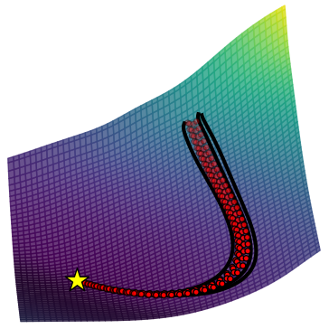
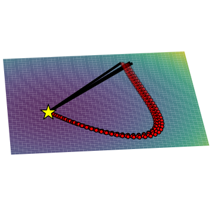
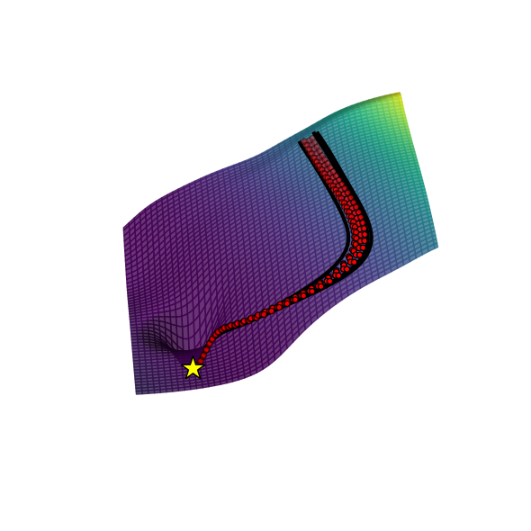
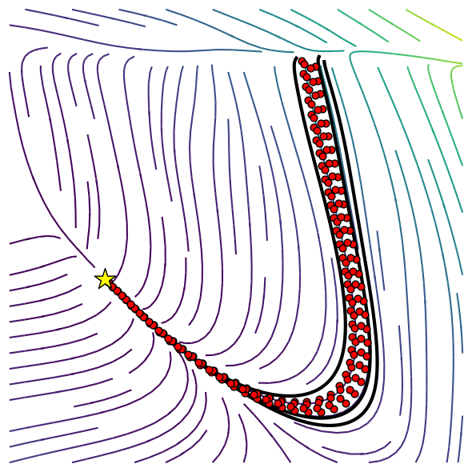
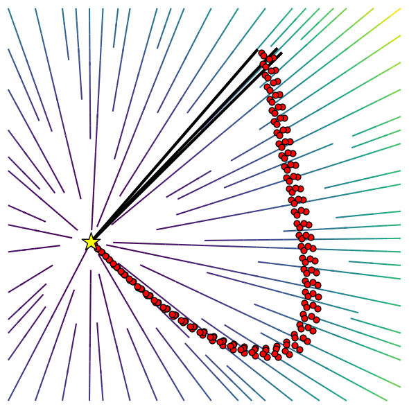
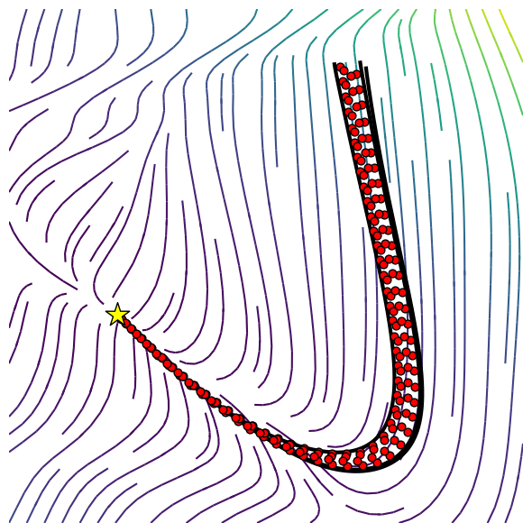

# Learn Embedding
Repository containing the code to learn stable dynamical system encoding non-linearity within underlying manifold's curvature.
Paper: https://arxiv.org/abs/2403.11948

<p align="center">
  
  
  
</p>

<p align="center">
  
  
  
</p>   

### Authors/Maintainers

- Bernardo Fichera (bernardo.fichera@epfl.ch)

### Run examples
In order to train a model
```sh
python(python3) -m examples.train_model --data <dataset_name>
(ipython) run examples/train_model.py --data <dataset_name>
```
where the line commands **data** can be used to set the training dataset. In oder to test a trained model
```sh
python(python3) -m examples.test_model --data <dataset_name>
(ipython) run examples/test_model.py --data <dataset_name>
```
where the line command **data** can be used load the model/dataset.

### Install the package
In order to install the package in `.local` run
```sh
pip(pip3) install .
```
For local installation in the current directory
```sh
pip(pip3) install -e .
```
